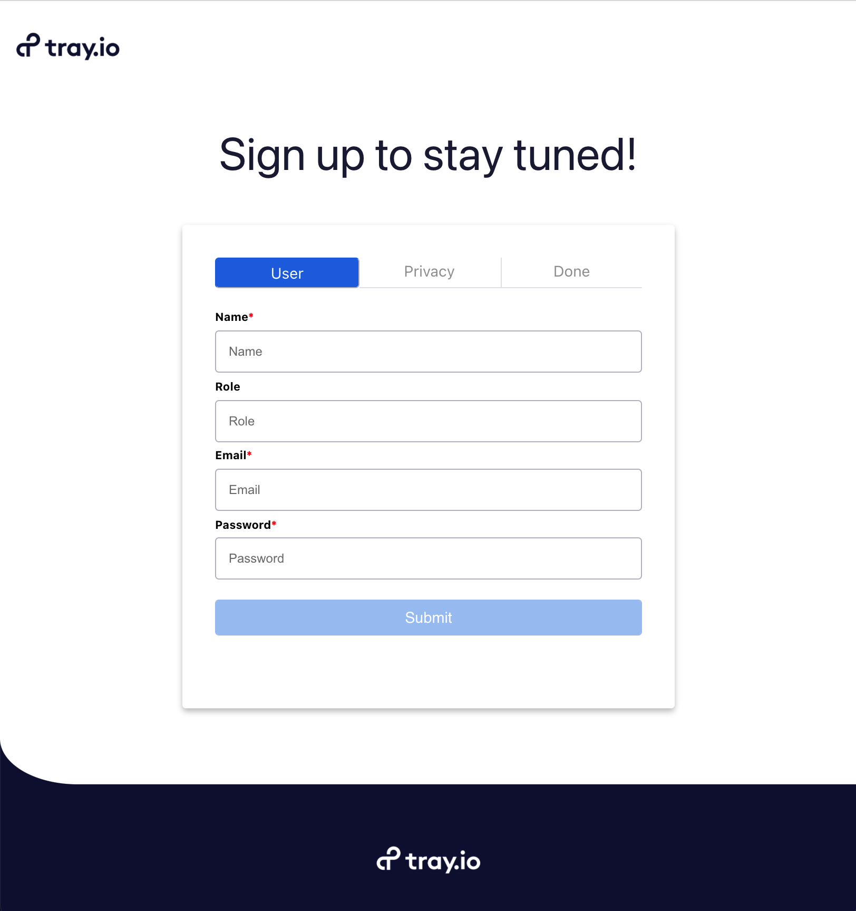

# React Form Component

<p align="center">
  
  </p>

### Table of Contents

- [Features](#Features)
- [Tech Stack](#tech-stack)
- [Getting Started](#getting-started)
- [Observations](#observations)

### Features 🦾

- 3 page form - text input, checkbox and confirmation page
- Tab navigation between form pages
- Form validation
- Validation errors show error messages and update on change
- Invalid form prevents progression to next page
- Final page `console.log`s the JSON data and disables navigation to other pages

### Tech Stack 🛠

- [React](https://reactjs.org/)
- [Typescript](https://www.typescriptlang.org/)

### Getting Started 🔌

##### Prerequesites

- 🪶 npm

  ```bash
  npm install npm@latest -g
  ```

##### Installation

1. 👯‍♀️ Clone this repo by running the following command in your terminal

   ```bash
   git clone https://github.com/maylynn-ng/form-component
   ```

2. 🔭 Navigate into the project directory

   ```bash
   cd form-component
   ```

3. 🏋🏻‍♀️ Install NPM packages

   ```bash
   npm install
   ```

4. :rocket: Run the app

   ```bash
   npm start
   ```

5. 🧪 Run tests if you like!

   ```bash
   npm test
   ```

Happy form filling! 🥳

#### Observations :male_detective:

- State management. While in a larger project I would opt to use Redux or React context, for an app of this size I didn't feel it necessary, and (even though I haven't seen the entire app) I would normally not save form data into a Redux store.

##### If I had more time 🧨

- Possibly implement routing to make logo route back to userForm page 
- Add more animations: between pages, shake if user clicks on disabled button
- Create this as more of a template so that it could be reused throughout the app
